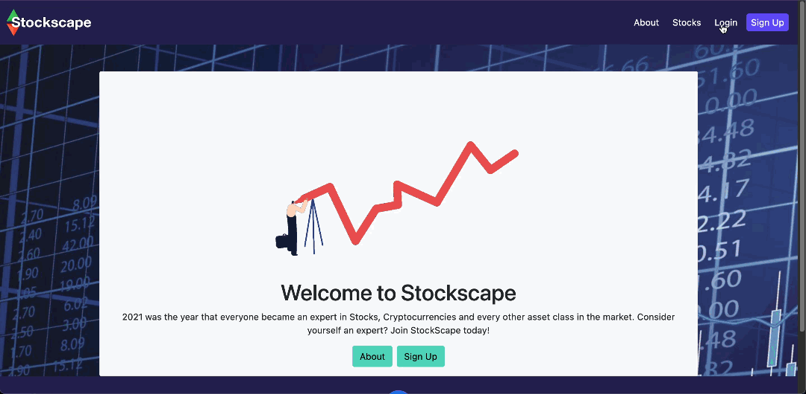
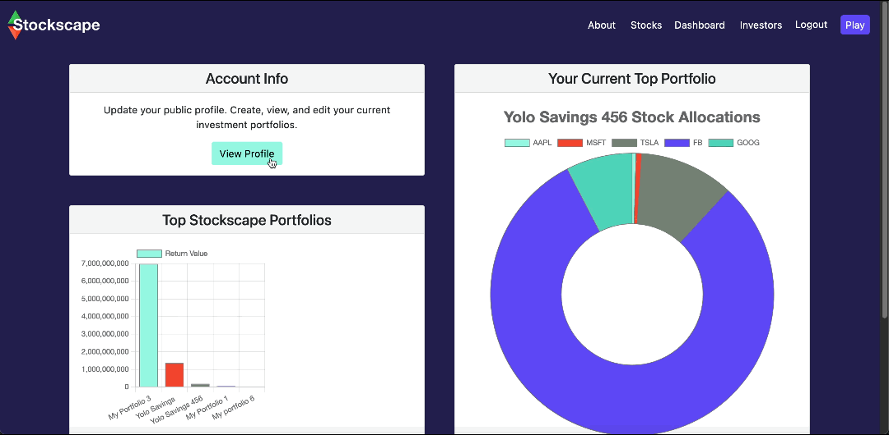

# Stockscape

## Table Of Contents

- [About The Project](#about-the-project)
  - [User Flow](#user-flow)
  - [Technologies Used](#technologies-used)
  - [Deployed Application](#deployed-application)
- [Contributors](#contributors)
- [Plans For Improvement](#plans-for-improvement)
- [Screenshots](#screenshots)

## About The Project

Stockscape tests users’ skills as they build portfolios and compete for the highest year-end earnings.

A full-stack web application, Stockscape takes inspiration from the chaos of the 2021 financial market; a time when many took interest in the stock market and how they could succeed. Users start with $1,000,000 in game funds to invest in their choice of up to 100 different company stocks. Year-end earnings are calculated instantly and displayed on the user's dashboard as a leaderboard of top Stockscape portfolios and within their portfolios list. Users can view other users' profiles and portfolios, update their public profile, and create as many investment portfolios as they wish.

### User Flow

When I deploy the application  
Then I am given the option to sign up, log in, or find more information  
When I have signed up  
Then I can press play to create a portfolio  
Then I can add stocks from companies page  
Once I have added the maximum amount of stocks  
Then I will be notified  
When I save my portfolio  
Then I can view my portfolios performance  
Then I can view others' & previous portfolios on dashboard page  
When I visit investors page  
Then I can view other users' profiles and portfolios

### Technologies Used

- Front End

  - HTML & Handlebars.js
  - Bootstrap & custom CSS
  - JavaScript & jQuery
  - Chart.js package

- Back End

  - Express.js server
  - MySQL database & Sequelize package

### Deployed Application

- [Visit the deployed application](https://stockscape.herokuapp.com)

## Contributors

- [Conor Kelly](https://github.com/conorjkelly96)
- [Liana Laurentiu](https://github.com/lianavaleria15)
- [Matthew Palmer](https://github.com/tigerbath)
- [Kayle Rieger Patton](https://github.com/kayleriegerpatton)

## Plans For Improvement

- Additional data charts on dashboard
- Pull company/stock data from live API
- Head-to-head gameplay option

## Screenshots

### Login & Dashboard Charts

### Portfolio Stock Addition

### User Profile & Public Profiles

